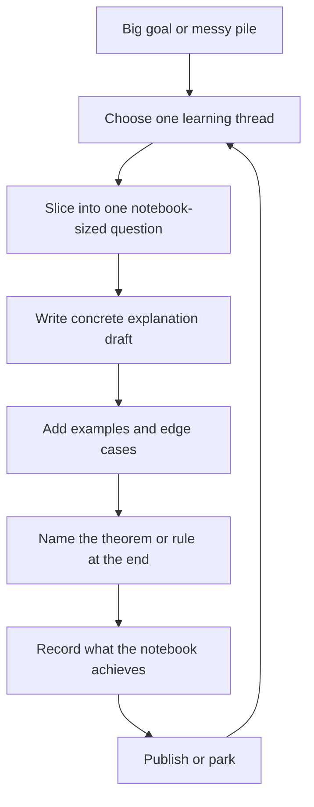

# Math Learning Notes Focus Roadmap

This roadmap sorts the current pile into a small number of lanes. The main goal is to keep the big vision alive without letting it block today's work.

## North Star

Build a personal library of fundamental math explanations where each idea is reconstructed from meaning, examples, edge cases, and notation.

The notes should become a place to relearn an idea without depending on memory.

## Workflow At A Glance

## Current Main Focus

For now, focus on discrete mathematics because it already has the most developed style and the clearest unfinished threads.

The active focus is:

- Divisibility rules through number composition and modular arithmetic.
- Combinatorics foundations beyond the already existing permutation, combination, binomial expansion, and Pascal material.
- Proof foundations that currently exist only as scattered remarks inside broader notebooks.

Do not start Roblox remakes, programming visualizations, finance notes, or broad university workflow redesign during this math focus block unless they directly support the notes.

## Next Three Deliverables

First deliverable: create a dedicated modular arithmetic note. The divisibility notebooks already contain the instincts, but modular arithmetic needs its own bridge note: remainder, congruence, operations that preserve congruence, and why division/cancellation is dangerous.

Second deliverable: create missing proof-foundation notes. Triangle inequality and induction appear scattered in reports, but they need standalone fundamental explanations.

Third deliverable: extend combinatorics beyond choosing and arranging. Add circular arrangements, stars and bars, indistinguishability, complement counting, and probability as separate notes instead of forcing them into one giant notebook.

## Active Backlog

These are allowed next after the first three deliverables.

- Logical notation.
- Linear algebra cofactor expansion.
- Harmonic series divergence from any point in the series.
- Taylor series for trigonometry and Euler's identity.
- Trigonometry notes moved into an online MathJax or canvas-friendly format.
- Jupyter notebooks migrated to Markdown where useful.
- Collated examples from pictures or handwritten work.

## Parked Ideas

These matter, but they should not compete with the current math sprint.

- Rebuild nostalgic Roblox games.
- Word-connection notes, especially Chinese meanings and semantic drift.
- University learning workflow.
- Better calendar or homework list.
- Downloading and indexing school pages.
- Programming language visualizations.
- Data structures and algorithms.
- Migration workflows.
- Three Kingdoms reading notes.
- Short video or other creative opportunities.
- Finance, trading, investing, and economics.

## Anti-Pile Rule

When the pile feels big, do not make a larger plan. Pick one thread and ask:

"What is the smallest notebook that would make this thread clearer?"

If the answer is bigger than one notebook, slice it again.

## Progress Metric

Progress is not measured by how much of mathematics is planned.

Progress is measured by finished explanations that can be reread later and used to rebuild the idea.

## Covered Enough For Now

These can be polished later, but they should not be treated as missing:

- Pascal's Triangle and Pascal's Identity.
- Basic permutation and combination.
- Binomial expansion.
- Divisibility rules from `$1$` to `$13$`.
- Number composition and place-value decomposition.
- Arithmetic sums, geometric sums, telescoping, symmetric sums, sums of squares, and sums of cubes.
