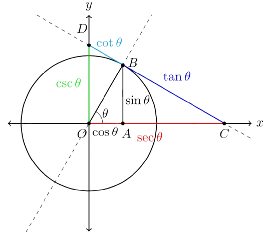
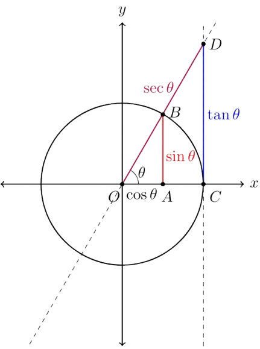
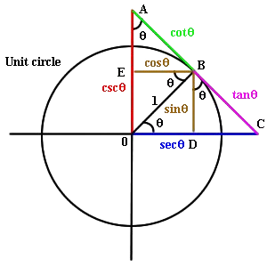

# 📐TRIGONOMETRY

To supplement Paul’s Math Notes Trigonometry Section
Chapter Sections will be based on: [**Sullivan’s Algebra and Trigonometry**](https://home.ufam.edu.br/andersonlfc/Nivelamento_Matem%C3%A1tica/Algebra%20&%20Trigonometry%20-%20Sullivan/Sullivan%20Algebra%20&%20Trigonometry%209th%20txtbk.pdf)
With Supplementary Practice using Schaum's Outline of Trigonometry 6th Edition (Couldn’t find a link for this)

---

## GEOMETRY ESSENTIALS

---

### --- Pythagorean Theorem

$$
\large{a^2 + b^2 = c^2}
$$
where $c$ is the longest side, $a$ and $b$ are the other $2$ sides of a Right-Angled Triangle

Therefore by rearrangement

##### Hypotenuse Formula

| Side         | Expression               | Description                        |
|--------------|--------------------------|------------------------------------|
| Hypotenuse   | $c = \sqrt{a^2 + b^2}$   | Calculates the longest side        |

##### Shorter Side Formulas

| Side         | Expression               | Description                        |
|--------------|--------------------------|------------------------------------|
| Side $a$     | $a = \sqrt{c^2 - b^2}$   | Solves for side $a$                |
| Side $b$     | $b = \sqrt{c^2 - a^2}$   | Solves for side $b$                |

Nothing much else except practice enough to identify the hypotenuse and its relative position to the adjacent and opposite sides

---

### --- Area, Perimeter, and Volume Formulas

Work out why the formulas are like this, do the work you will be much more convinced of the truthiness of these things and will therefore have a solid grip on the formulas

#### 2-Dimensional

For most of these just draw it out, you will find why it is correct

##### Rectangle

**$l$** is the length and **$w$** is the width

| Property   | Formula             |
|------------|---------------------|
| Area       | $lw$                |
| Perimeter  | $2(l + w)$          |

##### Square

**$l$** is the length of any of its sides

| Property   | Formula             |
|------------|---------------------|
| Area       | $l^2$                |
| Perimeter  | $4l$                 |

- A square can be taken as a special case of rectangles where all of its sides are equal

##### Triangle

**$b$** is the length of the base
**$h$** is the perpendicular height from the base to the highest point of the triangle
**$s$** is the semi-perimeter, meaning half the perimeter
**$a$** and $c$ are the other $2$ sides of the triangle

| Area Formula                |
|-----------------------------|
|$\dfrac{1}{2}bh$               |
|$\sqrt{s(s - a)(s - b)(s - c)}$  |

The second Area formula is called **Heron's Formula**, which relates the area of a triangle through its sides

Not taught in school

##### Parallelogram

**$b$** is the length of the base
**$a$** is the length of its other parallel side
**$h$** is the perpendicular height from the base to the highest point of the triangle

| Property   | Formula             |
|------------|---------------------|
| Area       | $bh$                |
| Perimeter  | $2(a + b)$           |

##### Rhombus

**$p$** is the length of the internal diagonal (let’s say short)
**$q$** is the length of the other internal diagonal (this will then be the long base)
**$l$** is the length of any side
h is the perpendicular distance from one side to the other

| Property   | Formula             |
|------------|---------------------|
| Area       | $lh$ or   $12pq$     |
| Perimeter  | $4l$                |

- A rhombus can be taken as a special case of parallelograms where all of its sides are equal

##### Trapezium

**$a$** is the length of one of the sides (let’s say short)
**$b$** is the length of the other side (this will then be the long base)
**$h$** is the perpendicular distance from one side to the other

| Property   | Formula             |
|------------|---------------------|
| Area       | $\dfrac{1}{2}(a + b)h$ |

##### Circle

**$r$** is the radius of the circle
**$D$** is the diameter which is equals to $2r$

| Property   | Formula                         |
|------------|---------------------------------|
| Area       | $r^2$                            |
| Perimeter  | $2r \pi$ or expressed as$D\pi$    |

- Proving this will require Calculus, or at least Limits

#### 3-Dimensional

##### Cuboid

**$l$** is the length of the cuboid
**$w$** is the width of the cuboid
**$h$** is the height of the cuboid

| Property      | Formula         |
|---------------|-----------------|
| Volume        | $lwh$            |
| Surface Area  | $2(lw + wh + lh)$  |

##### Cube

- Similarly, cubes can be taken as the special case of cuboids

**$l$** is the length, width, and height of the cuboid

| Property      | Formula    |
|---------------|------------|
| Volume        | $l^3$       |
| Surface Area  | $6l^2$      |

##### Sphere

r is the radius of its great circle

| Property      | Formula               |
|---------------|-----------------------|
| Volume        | $\dfrac{4}{3} \pi r^3$   |
| Surface Area  | $4 \pi r^2$            |

- Both Volume and Surface Area requires Integral Calculus to prove

##### Pyramid

**$s$** is the slant height of the pyramid

| Property      | Formula                                  |
|---------------|------------------------------------------|
| Volume        | $\dfrac{1}{3} (\text{Base} \times \text{Height})$ |
| Surface Area  | $2 (\text{Base} \times \text{Height}) \space + \space \text{Base}$         |

##### Cylinder

**$r$** is the radius of its base
**$D$** is the diameter of its base
**$h$** is the height of the cuboid

| Property      | Formula                                            |
|---------------|----------------------------------------------------|
| Volume        | $2 (\text{Base} \times \text{Height})$      |
| Surface Area  | $2 \pi r (r + h)$  or represented as $2 \pi r (r + h)$  |

- Volume is simply base x height here
- Surface area derivation here is simple, simply the $2$ circles and the area of the sides which is a rectangle if you make a cut along the height and pan it out

##### Cone

**$r$** is the radius of its base
**$s$** is the slant height of the cone

| Property      | Formula                                            |
|---------------|----------------------------------------------------|
| Volume        | $\dfrac{1}{3}(\text{Base} \space \times \space \text{Height})$      |
| Surface Area  | $\pi r (r + s)$  |

- Volume derivation requires Integral Calculus to prove
- Derivation of Surface Area comes from making a slanted cut on the slant side, then panning the 2D Shapes out, we will see that it forms a sector. We can then use the [[#Arc and Sector Formulas | Area of Sector Formula]] or use ideas of Calculus to get the surface area here

---

### --- Similarity and Congruence of Triangles

##### Congruence

- This means exactly the same size and shape

- **Criteria**
  Angle-Side-Angle    **(ASA)**
  Side-Side-Side        **(SSS)**
  Side-Angle-Side      **(SAS)**

 *Hypotenuse-Length   (HL)  is for Right-angled Triangles*

Check for equality for the above 3 criterions

**Similarity**

- This means having same shape different size
- A property of having the same shape, means that both the ratio of the sides and the angles within similar shapes are exactly the same

- **Criteria**
  Angle-Angle              **(AA)**
  Side-Side-Side        **(SSS)**
  Side-Angle-Side      **(SAS)**

  Check for proportionality for the above 3 criterions

---

## UNIT CIRCLE

---

### --- Angles

By convention:

- The angle is defined going counter-clockwise
- An angle is defined as originating from the positive $x$-axis in a unit circle, therefore any formula that compares one angle to another angle but in different polarity or trigonometric meaning will mean that the angle originates from the $x$-axis. This is known as the standard position.

##### Coterminal Angles

- Positive means from the same direction
- Negative means from the opposite direction
- Given that because of the nature of angles, every cycle ($360^{\circ}$) is technically a new angle, even though it is also the same angle
-This is the same principle as fractions with common divisors (i.e. $\dfrac{1}{2}$,$\dfrac{2}{4}$,$\dfrac{3}{6}$, $\cdots$)

##### Conversion between angle units

- Radians is literally the radius of $a$ circle used as the unit for the angle
- As the circumference is $2 \pi r$, one full revolution is therefore defined as $2 \pi$ radians

 **Direct tie between arc length and angle**

- Note that the consequence of this is that we have tied the arc length’s proportion directly to the angle
- Remember that a radian is basically the radius, so when we defined something at something radians we are putting it proportional to that amount of the radius, because radians is literally radius
- Well it happens that we defined the coefficient of the radius as the angle
- Therefore, any Arc Length is simply defined by (that particular angle) \*  radius
- Of course you have to take note that the angle is less than 2 in the first place, or make it within 2 through modulo (aka finding the remainder)
- Also do take note that **this only works in radians**, it will not work on degrees because there isn’t such a simple connection between degrees and the Arc Length.

- Since $2 \pi$ radians is also $360^{\circ}$, we find that $\pi$ radians = $180^{\circ}$. Wow! That’s pretty convenient!

$$
\begin{align}
&\dfrac{\pi}{180} \cdot \space \text{Degrees} = \text{Radians} \\
\\
&\dfrac{180}{\pi} \cdot \space \text{Degrees} = \text{Radians} \\
\end{align}
$$

- Or if you don’t remember this conversion to be honest you can just do proportion change of a revolution
$\dfrac{2 \pi}{360}$  Degrees or  $\dfrac{360}{2 \pi}$ Radians

- The above conversion formula is therefore just the simplified form of these proportion change equations
- Also generally just remember to spot that the angles are supposed to be in radians if you use this formula
 \- Awesome Simple Formula 🤝 Radians

##### Arc and Sector Formulas

| Concept         | Formula                        | Description                                 |
|----------------|----------------------------------|---------------------------------------------|
| Arc Length     | $\theta r$                      | Angle in radians times radius               |
| Area of Sector | $\frac{1}{2} \theta r^2$        | Half the product of angle and radius squared |
| Alt. Sector Area | $\frac{1}{2} \cdot \text{Arc Length} \cdot r$ | Equivalent form using arc length            |

- The Arc Length formula comes from the fact that arc length and angle are [**tied by the definition of radians**](#bookmark=id.m79u0r246wse)
- Hence, the simplification of $\dfrac{\theta}{2 \pi} \cdot 2 r \pi$, isn’t the most definitive reason

- The Area of the Sector can be derived by slicing the sector into many negligibly small slices, each of those sectors would look like a small triangle. As the slices would approach the shape of a triangle as it gets smaller, we can approximate the area as the sum of those small triangles with $\dfrac{1}{2}bh$

$$
\begin{aligned}
\text{Area} &= \frac{1}{2} b_1 h + \frac{1}{2} b_2 h + \frac{1}{2} b_3 h + \cdots + \frac{1}{2} b_n h \\
&\qquad \text{for however many regular slices of the sector}\\
&= \frac{1}{2}(b_1 + b_2 + b_3 + \cdots + b_n) h \\
&= \frac{1}{2} b h = \frac{1}{2} h b \\
&= \frac{1}{2} s r \quad \text{where } s \text{ is arc length and } r \text{ is radius}
\end{aligned}
$$
**for however many regular slices of the sector**

- The above was perhaps a much more satisfying and intuitive explanation that just, the simplification of $\dfrac{\theta}{2 \pi} \cdot \pi r^2$
- It is also a demonstration of breaking down a seemingly complex problem into a much simpler one,

> i.e. Area of Sector formula to Area of Triangle formula

- You can apply this to prove the circle formula as well
- Also note that $\pi$ has been eliminated from both arc length and sector formulas

---

### --- Right Triangle Trigonometry

##### Basic Proof of Side-Ratio Constancy to Angle

With an extended hypotenuse and base, we can construct another bigger triangle that is similar to the original one, therefore, the ratios between the sides of a right-angled triangle stay constant as long as they are similar. Check out [[#Similarity and Congruence of Triangles | Similarity of Triangles]]

With that said, similar triangles mean their angles are the same, this means we can tie the ratios of the side of a right-angled triangle to the acute angles within the triangle.
Therefore the ratios of the sides of a right-angled triangle can be said to be determined by either acute angles of a right-angled triangle.

- Specifically, these ratios are defined *relative to* a chosen acute angle, using the opposite, adjacent, and hypotenuse sides.

---

### --- Trigonometric Identities

##### Basic Properties

| Function        | Triangle Ratio                  |
|----------------|----------------------------------|
| $\sin \theta$  | $\dfrac{\text{opp}}{\text{hyp}}$ |
| $\csc \theta$  | $\dfrac{\text{hyp}}{\text{opp}}$ |
| $\cos \theta$  | $\dfrac{\text{adj}}{\text{hyp}}$ |
| $\sec \theta$  | $\dfrac{\text{hyp}}{\text{adj}}$ |
| $\tan \theta$  | $\dfrac{\text{opp}}{\text{adj}}$ |
| $\cot \theta$  | $\dfrac{\text{adj}}{\text{opp}}$ |

##### Reciprocal Properties

| Function        | Reciprocal Identity             |
|----------------|----------------------------------|
| $\sin \theta$  | $\dfrac{1}{\csc \theta}$         |
| $\cos \theta$  | $\dfrac{1}{\sec \theta}$         |
| $\tan \theta$  | $\dfrac{1}{\cot \theta}$         |

##### Complement Properties

| Identity Type       | Expression                                      |
|---------------------|-------------------------------------------------|
| Sine–Cosine         | $\cos \theta = \sin\left(\dfrac{\pi}{2} - \theta\right)$   $\sin \theta = \cos\left(\dfrac{\pi}{2} - \theta\right)$ |
| Tangent–Cotangent   | $\tan \theta = \cot\left(\dfrac{\pi}{2} - \theta\right)$   $\cot \theta = \tan\left(\dfrac{\pi}{2} - \theta\right)$ |
| Secant–Cosecant     | $\sec \theta = \csc\left(\dfrac{\pi}{2} - \theta\right)$   $\csc \theta = \sec\left(\dfrac{\pi}{2} - \theta\right)$ |

##### Periodic Properties

> Where $k$ is an integer

| Function        | Periodic Identity                |
|----------------|-----------------------------------|
| $\sin \theta$  | $\sin \theta = \sin(\theta + 2k\pi)$    |
| $\cos \theta$  | $\cos \theta = \cos(\theta + 2k\pi)$    |
| $\tan \theta$  | $\tan \theta = \tan(\theta + k\pi)$     |

- From these basic properties, we can see that sine is the anchor definition, and cosine here means complement of sine
- Cosecant means the complement of secant
- Complement means complement to $\dfrac{\pi}{2}$ radians
- Take note that because of undefined values when division by $0$, especially in $\tan$, $\csc$, $\sec$, and $\cot$, because the trigonometric functions they depend on can be $0$
- Opposite and Adjacent sides can be $0$ and meaningful work can still be done, but when hypotenuse equals $0$, everything becomes $0$ and no trigonometric meaning can happen. This is integral to Trigonometry.
- For more Information on why they are named that way, check out [**Etymology of Trigonometric Function Names**](https://kconrad.math.uconn.edu/math1131f19/handouts/trigfunctionnames.pdf)
- Get good at spotting the relative sides within a triangle at different angles of perspective

The unit circle is really useful to finding relationships between trigonometric functions because it simplifies the hypotenuse to $1$, you can prove a lot of the formulas shown later on with just the Unit Circle

The above are helpful representations of trigonometric functions, derive them by yourself see if you can find out why

---

### --- Pythagorean Identities

| Identity Type         | Expression                          |
|-----------------------|--------------------------------------|
| Sine–Cosine Identity  | $\sin^2 x + \cos^2 x = 1$            |
| Tangent–Secant        | $\tan^2 x + 1 = \sec^2 x$            |
| Cotangent–Cosecant    | $\cot^2 x + 1 = \csc^2 x$            |

---

### --- Unit Circle

---

### --- More Trigonometric Functions

---

**This docs is incomplete, I couldn’t add calculus stuff here at the time of writing**

***
Start Feb ~ End March (2025)
***
